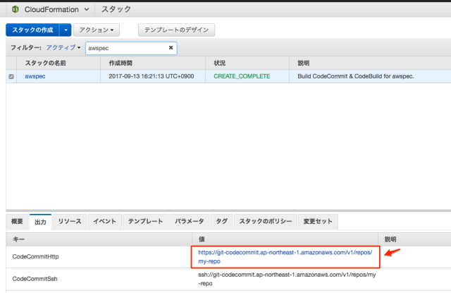

# AWS Codeシリーズから自動awspec

## awspecの準備
```bash
cd ./awspec
export AWS_DEFAULT_PROFILE=default
./90_setup.sh
./00run.sh
```

## CodeCommitにpushする
CodeCommitを使うのが初めての方は、AWSのドキュメントの通り認証ヘルパーを設定しておく。

> [AWS CLI 認証情報ヘルパーを使用して Windows 上で AWS CodeCommit リポジトリへの HTTPS 接続の設定手順 - AWS CodeCommit](https://docs.aws.amazon.com/ja_jp/codecommit/latest/userguide/setting-up-https-windows.html#setting-up-https-windows-credential-helper)

認証ヘルパーの設定ができたら、CodeCommitのリポジトリを追加してpush。CodeCommitのパスは作成したCloudFormationスタックの「出力」タブに出力される。



```bash
git remote add codecommit https://git-codecommit.ap-northeast-1.amazonaws.com/v1/repos/my-repo
git push codecommit --all
```

pushするとCodePipelineが動きはじめテストが開始。

## テスト結果を確認する
CodePipelineのコンソールを開いて、Source, Buildフェーズともに成功になっていれば成功。  
もしテストが失敗している場合にはCodeBuildコンソールの「ビルド履歴」を確認して原因を確認する。

## 環境変更後の再テスト
今後AWS環境を変更した時にはCodeCommitのmasterブランチに対して `git push` すると、自動的にawspecによるテストが実行される。

## さいごに
CodeBuildではソースを展開したディレクトリにある buildspec.yml に記述された処理を実行される。応用次第ではCodeCommitへのpushをトリガーに様々な処理を組み込めるかと。

---
# 参考サイト
- [CodeCommit/CodePipeline/CodeBuildで自動awspecしてくれる環境を作ってみました](https://dev.classmethod.jp/cloud/aws/automatic-awspec/)
